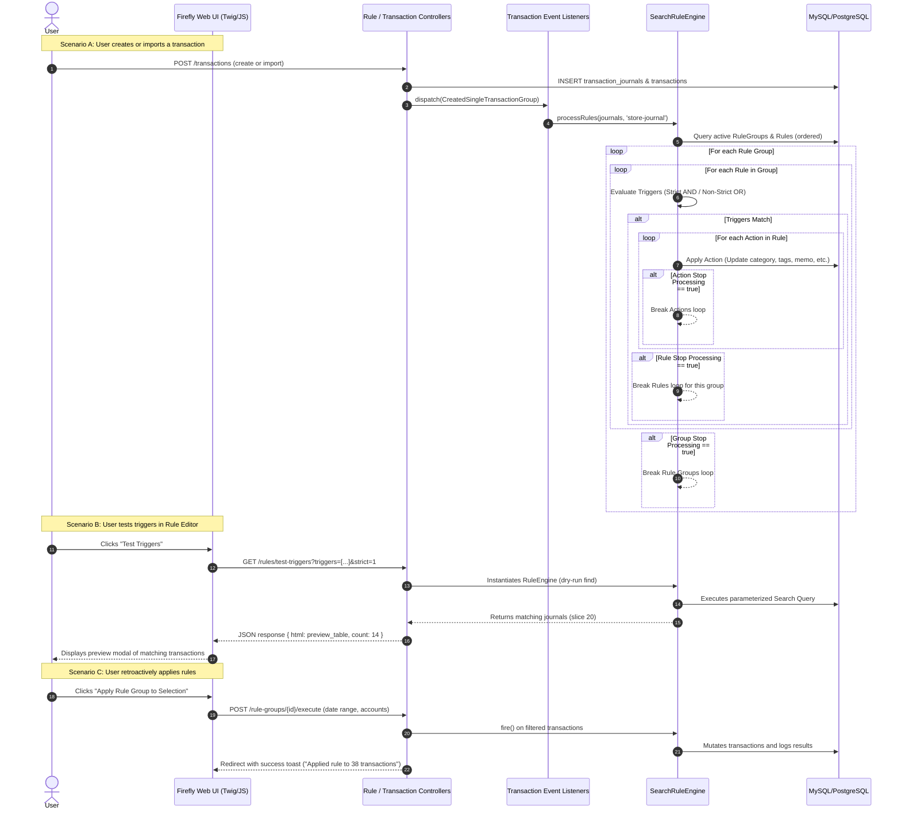

# Transaction Rules Engine: Architecture Analysis & Implementation Plan
**Feature:** Rules Management & Automated Execution System (Ported & Adapted from Firefly III)  
**Source Application:** `D:\Python Apps\python projects\AIAPPS\firefly-iii-main`  
**Target Application:** `D:\Python Apps\python projects\personal_finance_prod\Paisa_v1.1`  
**Target File Location:** `Paisa_v1.1/RULES_FEATURE_IMPLEMENTATION_PLAN.md`  
**Status:** Design & Architectural Specification (Pre-Implementation Phase)  

---

## 1. Executive Summary

Firefly III provides an expressive and deterministic transaction rule engine. Users organize rules into prioritized groups to inspect, classify, tag, alter, and link transactions automatically upon creation or modification, or manually in batch retroactively. In Firefly III, rules solve the tedious burden of repetitive transaction bookkeeping: assigning categories, appending notes, modifying transfer accounts, adding tags, or applying bill links based on pattern matches (merchants, amounts, descriptions, account types, etc.).

In the target application (**Paisa_v1.1**), users manage finances with a modern, high-performance TanStack Start (React 19, TypeScript, TailwindCSS v4, Vite, Supabase) stack. Paisa currently has fragmented or specialized automation attempts:
1. An unused initial `import_rules` table schema with basic text match fields.
2. A single-payee rule table (`payee_rules`) that defaults categories, memos, and tags only for memorized payees.
3. Heuristic pattern categorization (`payee_pattern_categories`) and LLM-assisted statement classifications (`statement-classify.server.ts`).

However, **Paisa lacks a unified, multi-attribute, user-controllable transaction automation rules engine**. Users cannot define composite rules such as: *"If merchant contains 'Uber' AND amount > 500, set category to 'Travel & Commute', add tag 'Cab', and mark as reviewed"*, nor can they test rules safely with dry-run previews against historical data, reorder rule priority groups, or batch-apply rules retroactively across date ranges and accounts.

This implementation plan reverse-engineers Firefly III's rule architecture—including its hierarchical group evaluation, strict (`AND`) vs. non-strict (`OR`) matching logic, inverted/prohibited triggers, cascading action execution, stop-processing controls, and interactive trigger testing—and translates it into a native, high-performance TypeScript implementation designed directly for Paisa's multi-tenant Supabase backend, TanStack Start server functions, and shadcn/Radix UI design system.

---

## 2. User-Visible Behavior of the Firefly Feature

In Firefly III, navigating to the **Rules** tab (`/rules`) presents the user with an interactive rules orchestration dashboard:

### 2.1 Rule Groups Hierarchy & Management
* **Hierarchical Grouping**: Rules do not exist in a flat, unorganized list. They are grouped into named containers (**Rule Groups**) such as *"Default Rules"*, *"Subscriptions & Bills"*, *"Salary & Tax"*, or *"Shopping Categorization"*.
* **Group Controls**:
  * **Order & Priority**: Groups run sequentially from top to bottom (Priority 1, Priority 2, etc.). Users can drag or use up/down buttons to reorder entire groups.
  * **Active / Inactive Toggle**: Entire rule groups can be enabled or disabled without deleting rules.
  * **Stop Processing**: If a group has "Stop Processing" enabled, once any rule inside that group triggers and executes, no subsequent rule groups are evaluated.
  * **Actions Menu**: Each group offers options to Edit, Delete, or **Apply Rule Group to Existing Transactions**.

### 2.2 Rule Builder & Display
Within each group, individual rules are displayed as cards or table rows:
* **Rule Card Elements**:
  * **Title & Description**: Clear label and optional markdown explanation.
  * **Status & Badges**: Displays whether the rule is `Active`, whether matching is `Strict` (All triggers must match / `AND`) or `Flexible` (Any trigger can match / `OR`), and if it `Stops Processing` further rules in the group.
  * **Trigger Moment**: Configured to run on transaction creation (`store-journal`), update (`update-journal`), or manual activation only.
  * **Triggers Summary**: Compact visualization of all triggers (e.g., `Description contains "Netflix"`, `Amount is greater than 10.00`).
  * **Actions Summary**: Compact list of operations (e.g., `Set Category to "Subscriptions"`, `Add Tag "recurring"`).
  * **Action Controls**: Reorder rules within the group via drag handles, Edit, Delete, Duplicate rule, and **Apply Rule to Transactions**.

### 2.3 Rule Creation & Editing Modal/Page
* **Mandatory Metadata**: Title, Rule Group assignment, Strict checkbox, Stop Processing checkbox, Trigger Moment selection.
* **Dynamic Triggers Builder**:
  * Allows adding $N$ triggers dynamically.
  * Select trigger field/operator: Merchant/Description, Amount (equals, greater, less, between), Source/Destination Account, Category, Notes, Tags, Transaction Type, Currency.
  * **Inversion / NOT Toggle (`prohibited`)**: Allows specifying negative conditions (e.g., `Description DOES NOT contain "Refund"`).
  * Contextual Value Input: Shows search autocompletes for Categories/Accounts/Tags, number pickers for amounts, or text inputs.
  * Trigger-level Stop Processing checkbox.
* **Live Test Triggers Modal ("Test Rule")**:
  * While editing or creating a rule, clicking the **"Test Triggers"** button triggers an asynchronous dry-run query.
  * Opens a dialog showing how many existing transactions match the current trigger configuration, accompanied by an interactive preview list of the top matching transactions.
  * Provides instant visual feedback to prevent typos or overly greedy regex/wildcards before saving.
* **Dynamic Actions Builder**:
  * Allows adding $N$ sequential actions.
  * Action types: `Set Category`, `Clear Category`, `Set Description`, `Append/Prepend Notes`, `Add Tag`, `Remove Tag`, `Remove All Tags`, `Set Account`, `Set Transfer Account`, `Convert Type`, `Link to Bill`, `Delete Transaction`.
  * Contextual input per action (e.g., Category dropdown, Tag input, Account selector).
  * Action-level Stop Processing flag.

### 2.4 Retroactive Execution ("Apply Rules to Transactions")
* Accessible at either the individual **Rule** level or entire **Rule Group** level.
* Opens a selection dialog allowing the user to filter:
  * Date range (`From Date` to `To Date`).
  * Target accounts (multiselect).
* Submitting executes the rules against all matching historical transactions and returns a flash toast notification detailing exactly how many transactions were updated.

---

## 3. End-to-End Firefly Execution Flow



---

## 4. Relevant Firefly Files and Responsibilities

| File Path | Primary Symbol | Architectural Responsibility |
| :--- | :--- | :--- |
| `app/Models/RuleGroup.php` | `RuleGroup` | Eloquent model for rule groups: user ownership, title, description, order, active flag, stop_processing flag, soft deletes. |
| `app/Models/Rule.php` | `Rule` | Eloquent model for individual rules: links to `RuleGroup`, strict flag (`AND` vs `OR`), order, active flag, stop_processing flag. |
| `app/Models/RuleTrigger.php` | `RuleTrigger` | Eloquent model for triggers: `trigger_type`, `trigger_value`, `order`, `active`, `stop_processing`. Encodes NOT logic via `-` prefix. |
| `app/Models/RuleAction.php` | `RuleAction` | Eloquent model for actions: `action_type`, `action_value`, `order`, `active`, `stop_processing`. Evaluates string templates/expressions. |
| `app/TransactionRules/Engine/RuleEngineInterface.php` | `RuleEngineInterface` | Contract defining `setUser()`, `setRuleGroups()`, `setRules()`, `find()`, `fire()`, `addOperator()`, `getResults()`. |
| `app/TransactionRules/Engine/SearchRuleEngine.php` | `SearchRuleEngine` | Core evaluator: translates triggers into queries, processes matches against rule groups, executes actions sequentially, enforces stop flags. |
| `app/TransactionRules/Factory/ActionFactory.php` | `ActionFactory` | Instantiates appropriate Action handler classes based on `action_type` string. |
| `app/TransactionRules/Actions/SetCategory.php` | `SetCategory` | Action implementation: loads or creates target category and attaches it to the transaction journal. |
| `app/TransactionRules/Actions/AddTag.php` | `AddTag` | Action implementation: creates/links tags without duplicating existing tags. |
| `app/TransactionRules/Actions/SetDescription.php` | `SetDescription` | Action implementation: overrides transaction description with static text or expressions. |
| `app/TransactionRules/Actions/SetNotes.php` | `SetNotes` | Action implementation: updates or appends notes/memo on the transaction journal. |
| `app/Repositories/Rule/RuleRepository.php` | `RuleRepository` | CRUD repository: manages transactions for storing, ordering, updating triggers/actions, and duplicating rules. |
| `app/Repositories/RuleGroup/RuleGroupRepository.php` | `RuleGroupRepository` | CRUD repository for rule groups, managing ordering, active states, and eager loading of child rules. |
| `app/Http/Controllers/Rule/IndexController.php` | `IndexController` | Web controller rendering the list of all rule groups and rules (`rules.index`). |
| `app/Http/Controllers/Rule/CreateController.php` | `CreateController` | Handles creation form rendering and rule storage. |
| `app/Http/Controllers/Rule/SelectController.php` | `SelectController` | Handles `testTriggers()` (dry-run live test) and `execute()` (retroactive batch application to selected transactions). |
| `app/Http/Controllers/RuleGroup/ExecutionController.php` | `ExecutionController` | Handles batch retroactive application for an entire Rule Group. |
| `app/Listeners/Model/TransactionGroup/ProcessesNewTransactionGroup.php` | `ProcessesNewTransactionGroup` | Async queue listener executing rules automatically when new transactions are persisted (`store-journal`). |
| `app/Listeners/Model/TransactionGroup/ProcessesUpdatedTransactionGroup.php` | `ProcessesUpdatedTransactionGroup` | Async queue listener executing rules automatically when existing transactions are updated (`update-journal`). |
| `resources/views/rules/index.twig` | Twig template | Rules tab UI: collapsible group boxes, draggable rule rows, trigger/action badges, active switches, trigger test modal. |
| `resources/views/rules/rule/create.twig` | Twig template | Rule editor form: dynamic trigger/action tables, condition operators, NOT checkboxes. |
| `public/v1/js/ff/rules/create-edit.js` | jQuery/Vanilla JS | Client-side dynamic trigger/action row addition, trigger test AJAX call, DOM rendering. |

---

## 5. Existing Architecture in Target App (`Paisa_v1.1`)

Paisa is built with a modern React 19 + TanStack Start full-stack architecture. The relevant subsystems for rule integration include:

### 5.1 Technology Stack & Core Patterns
* **Runtime & Framework**: Node.js / Bun, TanStack Start (`@tanstack/react-start`), TanStack Router (`@tanstack/react-router`), Vite 8.
* **Frontend Primitives**: React 19, TailwindCSS v4, Radix UI (`@radix-ui/*`), Lucide React icons (`lucide-react`), Sonner toasts (`sonner`), Motion (`motion`).
* **Data Access & State**: `@tanstack/react-query` (TanStack Query v5) for server state management and query invalidation; Supabase client (`@supabase/supabase-js`) for database interactions.
* **Validation**: Zod 4 for strict runtime validation on both backend server functions and frontend forms.
* **Server Functions**: TanStack Start `createServerFn` with standard `.middleware([requireSupabaseAuth])`, `.inputValidator(...)`, and `.handler(async ({ context, data }) => { ... })`.

### 5.2 Multi-Tenancy & Authorization Model
* Paisa enforces strict multi-tenancy via `household_id`.
* The authenticated user's active household is resolved in server functions via `await getHouseholdId(context)`.
* Every business entity (`transactions`, `categories`, `accounts`, `bills`, `payees`) has a foreign key `household_id REFERENCES households(id) ON DELETE CASCADE` and Supabase Row Level Security (RLS) policies enforcing household isolation.

### 5.3 Transactions Data Model (`transactions` table)
Transactions in Paisa are flat records containing:
* Primary keys: `id` (uuid), `household_id` (uuid), `created_at`, `updated_at`.
* Core financial: `account_id` (uuid), `transfer_account_id` (uuid, nullable), `category_id` (uuid, nullable), `type` (`income` | `expense` | `transfer`), `amount` (numeric), `txn_date` (date).
* Descriptive: `merchant` (text), `memo` (text), `note` (text), `tags` (text[]), `payment_method` (text), `check_number` (text), `tax_code` (text).
* Workflow flags: `cleared_status` (`pending` | `cleared` | `reconciled`), `is_flagged` (bool), `is_favorite` (bool), `is_reviewed` (bool), `is_read` (bool).
* Audit & relationships: `split_parent_id` (uuid, nullable), `attachment_count` (int), `comment_count` (int).

### 5.4 Existing Rule-like Tables & Why They Are Insufficient
* `import_rules`: Exists in initial migration (`match_field`, `match_type`, `match_value`, `category_id`, `priority`), but is completely unmaintained, has no UI, supports only single field matches, and only assigns categories.
* `payee_rules`: Specialized for single-payee presets (`payee_id`, `txn_type`, `category_id`, `transfer_account_id`, `memo`, `tags`, `min_amount`, `max_amount`). It cannot match arbitrary patterns, descriptions, accounts, or multi-field criteria.
* `payee_pattern_categories`: Regex/exact pattern memory for statement imports.

---

## 6. Firefly-to-Target Mapping Table

| Firefly Element | Firefly Location | Responsibility | Target Equivalent | Reuse, Adapt, or Create | Target Location |
| :--- | :--- | :--- | :--- | :--- | :--- |
| `rule_groups` table | `database/migrations/2016_06_16_000002_create_main_tables.php` | Stores rule group hierarchy, order, stop_processing | `rule_groups` table | **Create** (adapted to UUID PKs & `household_id` RLS) | `supabase/migrations/20260904000000_rules_engine_system.sql` |
| `rules` table | `database/migrations/2016_06_16_000002_create_main_tables.php` | Stores individual rules, strict flag, order, active, stop_processing | `rules` table | **Create** (adapted to UUID PKs, household scope, trigger moment enum) | `supabase/migrations/20260904000000_rules_engine_system.sql` |
| `rule_triggers` table | `database/migrations/2016_06_16_000002_create_main_tables.php` | Stores triggers per rule, order, active, stop_processing | `rule_triggers` table | **Create** (with explicit `is_inverted` bool instead of `-` prefix) | `supabase/migrations/20260904000000_rules_engine_system.sql` |
| `rule_actions` table | `database/migrations/2016_06_16_000002_create_main_tables.php` | Stores actions per rule, order, active, stop_processing | `rule_actions` table | **Create** (with typed action enum and target value payload) | `supabase/migrations/20260904000000_rules_engine_system.sql` |
| `SearchRuleEngine` | `app/TransactionRules/Engine/SearchRuleEngine.php` | Evaluates triggers, coordinates cascading rule groups, executes actions | `executeRulesOnTransaction` & `evaluateRuleMatch` | **Create** (Pure TypeScript rule engine in Paisa) | `src/lib/rules-engine.server.ts` |
| `ActionFactory` & Action classes | `app/TransactionRules/Actions/*` | Individual mutation actions (SetCategory, AddTag, etc.) | Pure action dispatchers | **Create** (TypeScript action pipeline operating directly on transaction objects) | `src/lib/rules-engine.server.ts` |
| `RuleRepository` & `RuleGroupRepository` | `app/Repositories/Rule/*` & `RuleGroup/*` | Data access layer for rules and groups | Server functions | **Create** (`listRuleGroups`, `upsertRuleGroup`, `upsertRule`, `deleteRule`, etc.) | `src/lib/rules.functions.ts` |
| `SelectController::testTriggers` | `app/Http/Controllers/Rule/SelectController.php` | Dry-run execution to preview matching transactions | `testRuleTriggers` server function | **Create** (Runs live trigger evaluation over recent transactions and returns matched rows) | `src/lib/rules.functions.ts` |
| `SelectController::execute` | `app/Http/Controllers/Rule/SelectController.php` | Retroactive batch application across historical transactions | `applyRuleBatch` server function | **Create** (Applies rule/group over date & account filters with transactional audit) | `src/lib/rules.functions.ts` |
| `ProcessesNewTransactionGroup` | `app/Listeners/Model/TransactionGroup/ProcessesNewTransactionGroup.php` | Event listener triggering rules on new transactions | Direct invocation in `upsertTransaction` & statement imports | **Adapt** (Hooks into `finance.functions.ts`, `transactions.functions.ts`, and statement pipeline) | `src/lib/finance.functions.ts`, `src/lib/statement-import.functions.ts` |
| `rules.index` Twig view | `resources/views/rules/index.twig` | Rules tab UI with accordion groups, draggable rules, status toggles | TanStack Start Route Component | **Create** (`_authenticated/rules.tsx` with Radix Accordions, Cards, and Tables) | `src/routes/_authenticated/rules.tsx` |
| Rule Create/Edit Modals | `resources/views/rules/rule/create.twig` | Rule configuration UI with dynamic triggers/actions | Dialog & Form Component | **Create** (`RuleEditorDialog.tsx`) | `src/components/rules/rule-editor-dialog.tsx` |
| Test Trigger Modal | `resources/views/rules/partials/test-trigger-modal.twig` | Modal showing live preview of matched transactions | Dialog Component | **Create** (`RuleTestPreviewDialog.tsx`) | `src/components/rules/rule-test-preview-dialog.tsx` |
| Sidebar Navigation | `resources/views/partials/menu.twig` | Navigation link to Rules | Sidebar link under "Planning" | **Modify** (`src/components/app-sidebar.tsx`) | `src/components/app-sidebar.tsx` |
| Query Keys Factory | N/A (Firefly uses server-rendered full page reloads) | Client caching and invalidation | `queryKeys.rules` | **Adapt** (Extend existing factory) | `src/lib/query-keys.ts` |

---

## 7. Required Database/Schema Changes

A new Supabase migration `supabase/migrations/20260904000000_rules_engine_system.sql` must be created with the following tables, foreign keys, RLS policies, and indexes:

### 7.1 Schema Definitions

```sql
-- 1. Create Enums
CREATE TYPE rule_trigger_moment AS ENUM ('create', 'update', 'create_and_update', 'manual_only');

CREATE TYPE rule_trigger_field AS ENUM (
  'merchant',
  'description',
  'amount',
  'account_id',
  'transfer_account_id',
  'category_id',
  'type',
  'memo',
  'note',
  'tags',
  'payment_method',
  'check_number',
  'cleared_status',
  'is_flagged'
);

CREATE TYPE rule_trigger_operator AS ENUM (
  'equals',
  'contains',
  'starts_with',
  'ends_with',
  'greater_than',
  'less_than',
  'between',
  'is_empty',
  'is_not_empty',
  'in_list',
  'matches_regex'
);

CREATE TYPE rule_action_type AS ENUM (
  'set_category',
  'clear_category',
  'set_merchant',
  'set_memo',
  'append_memo',
  'set_note',
  'append_note',
  'clear_note',
  'add_tag',
  'remove_tag',
  'remove_all_tags',
  'set_account',
  'set_transfer_account',
  'convert_type',
  'set_cleared_status',
  'set_flagged',
  'set_reviewed',
  'link_bill'
);

-- 2. Rule Groups Table
CREATE TABLE public.rule_groups (
  id UUID PRIMARY KEY DEFAULT gen_random_uuid(),
  household_id UUID NOT NULL REFERENCES public.households(id) ON DELETE CASCADE,
  title VARCHAR(255) NOT NULL,
  description TEXT,
  sort_order INT NOT NULL DEFAULT 0,
  is_active BOOLEAN NOT NULL DEFAULT true,
  stop_processing BOOLEAN NOT NULL DEFAULT false,
  created_at TIMESTAMPTZ NOT NULL DEFAULT now(),
  updated_at TIMESTAMPTZ NOT NULL DEFAULT now()
);

-- 3. Rules Table
CREATE TABLE public.rules (
  id UUID PRIMARY KEY DEFAULT gen_random_uuid(),
  household_id UUID NOT NULL REFERENCES public.households(id) ON DELETE CASCADE,
  rule_group_id UUID NOT NULL REFERENCES public.rule_groups(id) ON DELETE CASCADE,
  title VARCHAR(255) NOT NULL,
  description TEXT,
  trigger_moment rule_trigger_moment NOT NULL DEFAULT 'create',
  strict_mode BOOLEAN NOT NULL DEFAULT true, -- true = ALL triggers must match (AND), false = ANY trigger matches (OR)
  stop_processing BOOLEAN NOT NULL DEFAULT false, -- Stop evaluating subsequent rules in this group if matched
  sort_order INT NOT NULL DEFAULT 0,
  is_active BOOLEAN NOT NULL DEFAULT true,
  created_at TIMESTAMPTZ NOT NULL DEFAULT now(),
  updated_at TIMESTAMPTZ NOT NULL DEFAULT now()
);

-- 4. Rule Triggers Table
CREATE TABLE public.rule_triggers (
  id UUID PRIMARY KEY DEFAULT gen_random_uuid(),
  rule_id UUID NOT NULL REFERENCES public.rules(id) ON DELETE CASCADE,
  field rule_trigger_field NOT NULL,
  operator rule_trigger_operator NOT NULL,
  value TEXT NOT NULL DEFAULT '',
  value_secondary TEXT, -- Used for 'between' amounts or ranges
  is_inverted BOOLEAN NOT NULL DEFAULT false, -- NOT condition (e.g. DOES NOT contain)
  stop_processing BOOLEAN NOT NULL DEFAULT false,
  sort_order INT NOT NULL DEFAULT 0,
  is_active BOOLEAN NOT NULL DEFAULT true,
  created_at TIMESTAMPTZ NOT NULL DEFAULT now()
);

-- 5. Rule Actions Table
CREATE TABLE public.rule_actions (
  id UUID PRIMARY KEY DEFAULT gen_random_uuid(),
  rule_id UUID NOT NULL REFERENCES public.rules(id) ON DELETE CASCADE,
  action_type rule_action_type NOT NULL,
  action_value TEXT NOT NULL DEFAULT '',
  stop_processing BOOLEAN NOT NULL DEFAULT false,
  sort_order INT NOT NULL DEFAULT 0,
  is_active BOOLEAN NOT NULL DEFAULT true,
  created_at TIMESTAMPTZ NOT NULL DEFAULT now()
);

-- 6. Rule Execution Audit Log Table (Lightweight)
CREATE TABLE public.rule_execution_logs (
  id UUID PRIMARY KEY DEFAULT gen_random_uuid(),
  household_id UUID NOT NULL REFERENCES public.households(id) ON DELETE CASCADE,
  rule_id UUID REFERENCES public.rules(id) ON DELETE SET NULL,
  transaction_id UUID NOT NULL REFERENCES public.transactions(id) ON DELETE CASCADE,
  trigger_moment rule_trigger_moment NOT NULL,
  actions_applied JSONB NOT NULL DEFAULT '[]'::jsonb,
  executed_at TIMESTAMPTZ NOT NULL DEFAULT now()
);
```

### 7.2 Security & Indexes
```sql
-- Enable RLS
ALTER TABLE public.rule_groups ENABLE ROW LEVEL SECURITY;
ALTER TABLE public.rules ENABLE ROW LEVEL SECURITY;
ALTER TABLE public.rule_triggers ENABLE ROW LEVEL SECURITY;
ALTER TABLE public.rule_actions ENABLE ROW LEVEL SECURITY;
ALTER TABLE public.rule_execution_logs ENABLE ROW LEVEL SECURITY;

-- Policies for Household Isolation
CREATE POLICY rule_groups_household_policy ON public.rule_groups
  FOR ALL TO authenticated
  USING (has_household_access(household_id))
  WITH CHECK (has_household_access(household_id));

CREATE POLICY rules_household_policy ON public.rules
  FOR ALL TO authenticated
  USING (has_household_access(household_id))
  WITH CHECK (has_household_access(household_id));

CREATE POLICY rule_triggers_household_policy ON public.rule_triggers
  FOR ALL TO authenticated
  USING (EXISTS (SELECT 1 FROM public.rules r WHERE r.id = rule_triggers.rule_id AND has_household_access(r.household_id)))
  WITH CHECK (EXISTS (SELECT 1 FROM public.rules r WHERE r.id = rule_triggers.rule_id AND has_household_access(r.household_id)));

CREATE POLICY rule_actions_household_policy ON public.rule_actions
  FOR ALL TO authenticated
  USING (EXISTS (SELECT 1 FROM public.rules r WHERE r.id = rule_actions.rule_id AND has_household_access(r.household_id)))
  WITH CHECK (EXISTS (SELECT 1 FROM public.rules r WHERE r.id = rule_actions.rule_id AND has_household_access(r.household_id)));

CREATE POLICY rule_execution_logs_policy ON public.rule_execution_logs
  FOR ALL TO authenticated
  USING (has_household_access(household_id))
  WITH CHECK (has_household_access(household_id));

-- Performance Indexes
CREATE INDEX idx_rule_groups_household_order ON public.rule_groups(household_id, sort_order);
CREATE INDEX idx_rules_group_order ON public.rules(rule_group_id, sort_order);
CREATE INDEX idx_rules_household_active ON public.rules(household_id, is_active);
CREATE INDEX idx_rule_triggers_rule_order ON public.rule_triggers(rule_id, sort_order);
CREATE INDEX idx_rule_actions_rule_order ON public.rule_actions(rule_id, sort_order);
CREATE INDEX idx_rule_logs_txn ON public.rule_execution_logs(transaction_id);
```

---

## 8. Required API & Backend Changes

All server logic will be implemented as modular, type-safe TanStack Start server functions in `src/lib/rules.functions.ts` and `src/lib/rules-engine.server.ts`.

### 8.1 Pure Rule Engine (`src/lib/rules-engine.server.ts`)
This server module encapsulates the deterministic evaluation logic without coupling to HTTP controllers:
1. `evaluateRuleMatch(ruleWithTriggers, transaction)`:
   * Iterates through active `rule_triggers` in priority order.
   * Compares the transaction attribute against the operator and target value.
   * Supports operators:
     * `equals`: Case-insensitive string match or numeric equality.
     * `contains`: Substring match.
     * `starts_with` / `ends_with`: Substring boundary matches.
     * `greater_than` / `less_than`: Numeric comparison on `amount`.
     * `between`: `amount >= val && amount <= val2`.
     * `in_list`: Comma-separated list matching.
     * `matches_regex`: Safe regex execution with timeout guards.
   * Inverts result if `is_inverted` is true.
   * If `strict_mode` is `true`: returns `false` on first non-match (`AND`).
   * If `strict_mode` is `false`: returns `true` on first match (`OR`).
   * Handles trigger-level `stop_processing`.
2. `applyRuleActions(ruleWithActions, transaction)`:
   * Returns a transaction patch object `{ patch, actionsApplied }`.
   * Executes actions sequentially:
     * `set_category`: Sets `category_id`.
     * `clear_category`: Sets `category_id = null`.
     * `set_merchant`: Overrides `merchant`.
     * `set_memo`: Sets `memo`.
     * `append_memo`: Appends string to existing `memo`.
     * `set_note`: Sets `note`.
     * `append_note`: Appends to `note`.
     * `clear_note`: Sets `note = null`.
     * `add_tag`: Adds tag if not already in `tags` array.
     * `remove_tag`: Filters tag from `tags` array.
     * `remove_all_tags`: Sets `tags = []`.
     * `set_account`: Modifies `account_id`.
     * `set_transfer_account`: Sets `transfer_account_id`.
     * `convert_type`: Switches `type` (`income` | `expense` | `transfer`).
     * `set_flagged`: Sets `is_flagged`.
     * `set_reviewed`: Sets `is_reviewed`.
     * `link_bill`: Updates bill association.
   * Respects action-level `stop_processing`.
3. `executeRulesPipeline(supabase, householdId, transaction, triggerMoment)`:
   * Loads all active `rule_groups` and child `rules` ordered by `sort_order`.
   * Filters rules by `triggerMoment` (`create`, `update`, etc.).
   * Runs the cascading evaluation loop with group-level and rule-level `stop_processing` support.
   * Returns modified transaction patch and list of applied rule IDs.

### 8.2 Server Functions (`src/lib/rules.functions.ts`)
1. `listRuleGroups`: Fetches all rule groups with nested rules, triggers, and actions for the current household.
2. `upsertRuleGroup`: Creates or updates a rule group (title, description, is_active, stop_processing, sort_order).
3. `deleteRuleGroup`: Deletes a rule group (cascades to rules, triggers, actions).
4. `reorderRuleGroups`: Batch updates `sort_order` for an array of group IDs.
5. `upsertRule`: Creates or updates an individual rule, replacing or updating its child triggers and actions in a single atomic transaction.
6. `deleteRule`: Deletes a rule and child triggers/actions.
7. `duplicateRule`: Duplicates a rule with all child triggers and actions (named `"Copy of [Title]"`).
8. `reorderRules`: Batch updates `sort_order` of rules within a rule group.
9. `testRuleTriggers`:
   * Input: `{ triggers: RuleTriggerInput[], strict_mode: boolean, limit?: number }`.
   * Fetches the recent 100 transactions for the household.
   * Evaluates the in-memory triggers without modifying database rows.
   * Returns `{ matchCount: number, matchedTransactions: TransactionPreview[] }`.
10. `applyRuleBatch`:
    * Input: `{ ruleId?: string, ruleGroupId?: string, startDate?: string, endDate?: string, accountIds?: string[], dryRun?: boolean }`.
    * Queries transactions matching the filter criteria.
    * Executes the rule engine.
    * If `dryRun == false`, applies mutations to database and records execution logs.
    * Returns `{ processedCount: number, changedCount: number, changes: DetailedChangeLog[] }`.

### 8.3 Integration Hooks into Existing Paisa Systems
* In `src/lib/finance.functions.ts` (`upsertTransaction`): When a transaction is newly created or edited, invoke `executeRulesPipeline`.
* In `src/lib/statement-import.functions.ts` and `src/lib/statement-classify.server.ts`: After statement rows are parsed and normalized, run `executeRulesPipeline` prior to committing to the ledger.
* In `src/lib/mcp/tools/create-transaction.ts`: Automatically evaluate rules on transactions created via AI or MCP tools.

---

## 9. Required Frontend Changes

### 9.1 New Route: `src/routes/_authenticated/rules.tsx`
* Defines route `/_authenticated/rules` in TanStack Router.
* Displays header with "Rules & Automations", subtitle, and primary actions:
  * **"+ New Rule"** (opens Rule Editor Dialog)
  * **"+ New Group"** (opens Rule Group Dialog)
  * **"Re-run All Rules"** (opens retroactive batch execution modal)
* Renders collapsible accordion cards for each `RuleGroup`:
  * Group header shows group title, active badge, rule count, stop processing icon, and kebab dropdown menu (Edit Group, Delete Group, Apply Group, Move Up, Move Down).
  * Group body contains the list of rules with interactive controls:
    * Drag/reorder grip.
    * Rule title and description.
    * Badges: `Strict (AND)` vs `Any (OR)`, `On Create`, `On Update`, `Stops Group`.
    * Triggers summary chip group (e.g. `[Merchant contains 'Swiggy']`, `[Amount > 200]`).
    * Actions summary chip group (e.g. `[Set Cat: Food]`, `[Add Tag: Delivery]`).
    * Inline `Switch` to enable/disable the rule immediately.
    * Action buttons: Edit, Duplicate, Test, Apply to History, Delete.
* Empty states when no groups or rules exist, prompting to create starter rules.

### 9.2 Rule Editor Component: `src/components/rules/rule-editor-dialog.tsx`
* Full dialog allowing creation or editing of a rule:
  * **General Settings**: Title, Rule Group picker, Trigger Moment (`On Create`, `On Update`, `Both`, `Manual Only`), Strict Mode switch, Stop Processing switch.
  * **Triggers Table**:
    * Dynamic row addition and deletion.
    * Trigger field dropdown (Merchant, Amount, Account, Category, Type, Notes, Tags, etc.).
    * Operator dropdown (Equals, Contains, Starts with, Greater than, Less than, Between).
    * `NOT` (Invert) checkbox.
    * Dynamic value selector (Autocomplete Combobox for Categories/Accounts/Tags, numeric inputs for amounts, text fields).
    * "Test Triggers" button: calls `testRuleTriggers` and displays match count badge directly on the form.
  * **Actions Table**:
    * Dynamic row addition and deletion.
    * Action type dropdown (`Set Category`, `Add Tag`, `Set Memo`, `Set Account`, etc.).
    * Contextual target input (Category selector popover, Account dropdown, text input).
    * Stop processing remaining actions checkbox.
  * Dialog footer: Cancel, "Test Rule", and Save Rule buttons.

### 9.3 Trigger Test & Preview Dialog: `src/components/rules/rule-test-preview-dialog.tsx`
* Displays the results of `testRuleTriggers`:
  * Match summary banner: *"Matches X out of Y inspected recent transactions"*.
  * Table of matched transactions showing Date, Account, Merchant, Amount, Current Category, and a visual preview of what the rule *would* change (e.g. `Category: Uncategorized → Food & Dining`).
  * Instant reassurance before committing.

### 9.4 Retroactive Batch Execution Dialog: `src/components/rules/rule-batch-apply-dialog.tsx`
* Modal to run a rule or group across history:
  * Scope selector: Single Rule or Entire Rule Group.
  * Date range filter (All time, This month, Last 90 days, Custom date range).
  * Account filter (All accounts or selected accounts).
  * Dry-run preview toggle.
  * Progress indicator and completion summary showing number of modified transactions.

### 9.5 Navigation & Query Keys Integration
* **`src/components/app-sidebar.tsx`**: Add `Rules` under the `Planning` group:
  ```tsx
  { title: "Rules", url: "/rules", icon: SlidersHorizontal }
  ```
* **`src/lib/query-keys.ts`**: Add `rules` namespace:
  ```ts
  rules: {
    all: ["rules"] as const,
    groups: () => [...queryKeys.rules.all, "groups"] as const,
    detail: (id: string) => [...queryKeys.rules.all, "detail", id] as const,
    test: (payload: unknown) => [...queryKeys.rules.all, "test", payload] as const,
  }
  ```

---

## 10. Detailed Phased Implementation Plan

### Phase 1: Database Migration & Schema Foundation
* **Objective**: Create database schema for rule groups, rules, triggers, actions, and audit logs with multi-tenant RLS policies.
* **Target Files**:
  * `[NEW]` `supabase/migrations/20260904000000_rules_engine_system.sql`
  * `[MODIFY]` `src/integrations/supabase/types.ts` (regenerate or declare Supabase types for the new tables)
* **Logic**:
  * Define enums (`rule_trigger_moment`, `rule_trigger_field`, `rule_trigger_operator`, `rule_action_type`).
  * Create tables `rule_groups`, `rules`, `rule_triggers`, `rule_actions`, `rule_execution_logs`.
  * Add foreign keys with cascading deletes.
  * Enable RLS with `has_household_access(household_id)`.
  * Add performance composite indexes.
* **Risk & Effort**: Low risk, Small effort.

### Phase 2: Core Server Engine & Domain Logic
* **Objective**: Implement pure TypeScript rule evaluation, action mutations, and cascading pipeline.
* **Target Files**:
  * `[NEW]` `src/lib/rules-engine.server.ts`
* **Logic**:
  * Implement `evaluateRuleMatch(rule, transaction)`.
  * Implement `applyRuleActions(rule, transaction)`.
  * Implement `executeRulesPipeline(supabase, householdId, transaction, moment)`.
  * Handle edge cases: missing null fields, case-insensitive string comparisons, safe regex handling, array tag operations without duplicates.
* **Risk & Effort**: Medium risk (core correctness), Medium effort.

### Phase 3: Server Functions & API Layer
* **Objective**: Expose typed TanStack Start server functions for CRUD, testing, and batch execution.
* **Target Files**:
  * `[NEW]` `src/lib/rules.functions.ts`
  * `[MODIFY]` `src/lib/query-keys.ts`
* **Logic**:
  * Implement `listRuleGroups`, `upsertRuleGroup`, `deleteRuleGroup`, `reorderRuleGroups`.
  * Implement `upsertRule`, `deleteRule`, `duplicateRule`, `reorderRules`.
  * Implement `testRuleTriggers` (dry-run evaluator on recent transactions).
  * Implement `applyRuleBatch` (retroactive historical runner with optional dryRun flag).
  * Validate all inputs with Zod schemas.
* **Dependencies**: Phase 1 and Phase 2.
* **Risk & Effort**: Medium risk, Medium effort.

### Phase 4: Frontend Rule Builder & Test UI
* **Objective**: Build the user-facing Rules dashboard, dynamic editor, and test preview dialogs.
* **Target Files**:
  * `[NEW]` `src/routes/_authenticated/rules.tsx`
  * `[NEW]` `src/components/rules/rule-editor-dialog.tsx`
  * `[NEW]` `src/components/rules/rule-group-dialog.tsx`
  * `[NEW]` `src/components/rules/rule-test-preview-dialog.tsx`
  * `[NEW]` `src/components/rules/rule-batch-apply-dialog.tsx`
  * `[MODIFY]` `src/components/app-sidebar.tsx`
* **Logic**:
  * Build reactive accordion cards for rule groups.
  * Build dynamic forms with React Hook Form + Zod for adding multiple triggers and actions.
  * Connect category popovers, account dropdowns, and tag pickers.
  * Integrate test triggers preview modal.
  * Handle active/inactive toggle mutations with optimistic updates.
* **Dependencies**: Phase 3.
* **Risk & Effort**: Low risk, Large effort.

### Phase 5: Pipeline Integration & Automatic Triggers
* **Objective**: Wire automatic rule execution into transaction creation, updates, and statement imports.
* **Target Files**:
  * `[MODIFY]` `src/lib/finance.functions.ts` (`upsertTransaction`)
  * `[MODIFY]` `src/lib/transactions.functions.ts` (`patchTransaction`)
  * `[MODIFY]` `src/lib/statement-import.functions.ts` (`commitStatementTransactions`)
  * `[MODIFY]` `src/lib/mcp/tools/create-transaction.ts`
* **Logic**:
  * Before saving or immediately after parsing, run `executeRulesPipeline`.
  * If rules modify accounts, trigger account balance recomputation (`recomputeAccountBalance`).
  * Log execution to `rule_execution_logs`.
* **Dependencies**: Phase 2 and Phase 3.
* **Risk & Effort**: Medium risk (must not fail the parent transaction creation if a rule fails), Medium effort.

---

## 11. Test Plan

### 11.1 Unit Tests (`src/tests/rules-engine.test.ts`)
* **Strict Matching (`AND`)**: Verify rule triggers only when all conditions match; verify failure if one condition fails.
* **Flexible Matching (`OR`)**: Verify rule triggers if at least one condition matches.
* **Inverted Triggers (`is_inverted`)**: Verify `contains` vs `does not contain` logic.
* **Amount Operators**: Test `greater_than`, `less_than`, `between`, `equals`.
* **Action Modifications**: Test setting category, appending notes, adding/removing tags, converting types.
* **Stop Processing Flags**:
  * Group stop processing: verify subsequent groups are skipped.
  * Rule stop processing: verify subsequent rules in group are skipped.
  * Action stop processing: verify subsequent actions in rule are skipped.

### 11.2 Integration Tests
* Create a test rule via `upsertRule` in a test household.
* Call `testRuleTriggers` against seeded transactions and assert expected match count.
* Invoke `upsertTransaction` with a merchant matching the rule; assert transaction is saved with the rule's target category and tags.
* Call `applyRuleBatch` with a date filter; assert all matching historical transactions are updated in Supabase.

### 11.3 End-to-End & UI Verification
* Navigate to `/rules` in the browser.
* Create a new Rule Group: "Food & Delivery".
* Create a Rule: "Swiggy to Food":
  * Trigger: Merchant contains "Swiggy".
  * Action: Set Category to "Food & Dining", Add Tag "delivery".
* Click "Test Triggers": verify preview modal appears with matched transactions.
* Save the rule: verify rule appears inside "Food & Delivery" group with active badge.
* Add a manual transaction with merchant "Swiggy Koramangala": verify category is auto-assigned to "Food & Dining".

### 11.4 Performance & Reliability Tests
* Seed 5,000 transactions and 20 rules.
* Benchmark `applyRuleBatch`: execution must complete in $< 1.5$ seconds.
* Verify rule execution errors are caught gracefully and do not block regular transaction creation.

---

## 12. Risks, Ambiguities, and Architectural Decisions

### 12.1 Architectural Decisions
1. **Inversion Logic (`is_inverted` vs `-` prefix)**:
   * *Firefly Approach*: Firefly prefixes trigger types with `-` (e.g. `-description_contains`) in the database.
   * *Target Decision*: Store an explicit boolean column `is_inverted` in `rule_triggers`. This is cleaner, strictly typed in TypeScript, and avoids string manipulation quirks.
2. **Execution Timing & Architecture**:
   * *Firefly Approach*: Dispatches Laravel queue events (`ShouldQueue`).
   * *Target Decision*: In Paisa's serverless/Nitro runtime, synchronous in-process evaluation during `upsertTransaction` is faster and provides immediate feedback to the UI without requiring an external queue worker, while batch retroactive operations are executed via chunked streaming server functions.
3. **Expression Language Support**:
   * *Firefly Approach*: Firefly includes Symfony Expression Language for dynamic values.
   * *Target Decision*: For V1, support static strings, standard replacements, and append/prepend operations. Advanced regex capture group replacements (`$1`) can be added in Phase 2.

### 12.2 Risks & Mitigations
* **Greedy or Broken Regex**: A user might input an invalid or catastrophic backtracking regex.
  * *Mitigation*: Wrap regex execution in a `try/catch` with length limits and fallback to standard substring contains if compilation fails.
* **Infinite Trigger Loops on Update**: A rule that updates a transaction might trigger update listeners recursively.
  * *Mitigation*: Pass an internal `skipRules: true` flag during automated rule mutations, exactly like Firefly's `applyRules = false` flag.
* **Account Balance Invalidation**: Rules that alter accounts (`set_account`, `convert_type`) impact account balances.
  * *Mitigation*: Check if `account_id` or `amount` or `type` changed, and invoke `recomputeAccountBalance` for affected accounts.

---

## 13. Rollout, Feature-Flag, Migration, and Rollback Strategy

* **Schema Migration**: Standard Supabase SQL migration file `20260904000000_rules_engine_system.sql`. Does not alter or drop any existing tables.
* **Feature Flag**: Controlled via application preference or environment variable (e.g., `VITE_FEATURE_RULES_ENGINE=true`). If disabled, the sidebar link is hidden and pipeline bypasses rules.
* **Zero Downtime**: The new tables exist alongside existing tables. Old `payee_rules` continue functioning independently.
* **Rollback Strategy**: If issues arise, set feature flag to `false`. To completely roll back database changes, execute `DROP TABLE IF EXISTS public.rule_execution_logs, public.rule_actions, public.rule_triggers, public.rules, public.rule_groups CASCADE;` and drop associated enums.

---

## 14. Acceptance Criteria Checklist

- [ ] `rule_groups`, `rules`, `rule_triggers`, `rule_actions`, and `rule_execution_logs` tables created with RLS.
- [ ] Users can view, create, edit, delete, and reorder Rule Groups.
- [ ] Users can create rules with multiple triggers and actions.
- [ ] Strict mode (`AND` all triggers) and flexible mode (`OR` any trigger) work as intended.
- [ ] Inverted triggers (`DOES NOT contain`, `IS NOT equal`) work accurately.
- [ ] Stop processing works at Group, Rule, and Action levels.
- [ ] "Test Triggers" modal previews matching historical transactions in real time without mutating data.
- [ ] "Apply Rule to History" retroactively updates historical transactions with progress reporting.
- [ ] Creating a transaction automatically runs active rules matching `create` or `create_and_update`.
- [ ] Updating a transaction automatically runs active rules matching `update` or `create_and_update`.
- [ ] Multi-tenant isolation: Users cannot view or execute rules belonging to another household.
- [ ] All code conforms to Paisa's TypeScript, TanStack Start, and TailwindCSS v4 conventions.

---

## 15. Recommended Implementation Order

1. **Step 1: Database Migration**: Run `supabase/migrations/20260904000000_rules_engine_system.sql`.
2. **Step 2: Engine Implementation**: Build `src/lib/rules-engine.server.ts` and verify unit tests.
3. **Step 3: Server Functions**: Implement `src/lib/rules.functions.ts` with Zod validation.
4. **Step 4: UI Components**: Build `rule-editor-dialog.tsx`, `rule-test-preview-dialog.tsx`, `rule-batch-apply-dialog.tsx`.
5. **Step 5: Routes & Navigation**: Add `src/routes/_authenticated/rules.tsx` and sidebar link in `app-sidebar.tsx`.
6. **Step 6: Transaction Hookup**: Wire rules pipeline into `finance.functions.ts` and statement import pipeline.
7. **Step 7: Verification**: Execute end-to-end dry-run and live tests.

---

## 16. Questions That Genuinely Require Your Decision

> [!IMPORTANT]
> **Key Decision Points for Implementation:**
> 1. **Sidebar Navigation Placement**: Would you prefer **Rules** to be a top-level item in the sidebar under `Planning` (alongside Budgets, Categories, Payees, Bills), or as a dedicated tab inside `Settings`? *(Recommendation: Top-level item under `Planning` as in Firefly III).*
> 2. **Default Migration of Existing Payee Rules**: Should we provide an automatic one-time migration script that imports your existing `payee_rules` into a "Migrated Payee Rules" rule group? *(Recommendation: Yes, automatically migrate them so you don't lose existing payee defaults).*
> 3. **Execution during Statement Import**: Should rules execute automatically during bank statement CSV/Excel imports before or after the AI merchant classifier runs? *(Recommendation: Run deterministic user rules AFTER normalization but BEFORE AI classification, so user rules take precedence over AI guesses).*

---

## 17. Concise Implementation Checklist for a Coding Agent

```markdown
- [ ] 1. Create `supabase/migrations/20260904000000_rules_engine_system.sql` with enums, tables, RLS, and indexes.
- [ ] 2. Update `src/integrations/supabase/types.ts` with generated or augmented typings for rule tables.
- [ ] 3. Create `src/lib/rules-engine.server.ts` with `evaluateRuleMatch`, `applyRuleActions`, and `executeRulesPipeline`.
- [ ] 4. Create `src/lib/rules.functions.ts` with TanStack Start server functions for CRUD, `testRuleTriggers`, and `applyRuleBatch`.
- [ ] 5. Add `rules` namespace to `src/lib/query-keys.ts`.
- [ ] 6. Create `src/components/rules/rule-editor-dialog.tsx` with dynamic trigger/action form rows.
- [ ] 7. Create `src/components/rules/rule-test-preview-dialog.tsx` for dry-run trigger preview.
- [ ] 8. Create `src/components/rules/rule-batch-apply-dialog.tsx` for retroactive execution.
- [ ] 9. Create route `src/routes/_authenticated/rules.tsx` with group accordions, rule cards, and active switches.
- [ ] 10. Update `src/components/app-sidebar.tsx` with "Rules" link under Planning.
- [ ] 11. Hook `executeRulesPipeline` into `upsertTransaction` in `src/lib/finance.functions.ts`.
- [ ] 12. Create test suite in `src/tests/rules-engine.test.ts` verifying all trigger operators and action handlers.
- [ ] 13. Update `CHANGES.md` under current date as mandated by `AGENTS.md`.
```
