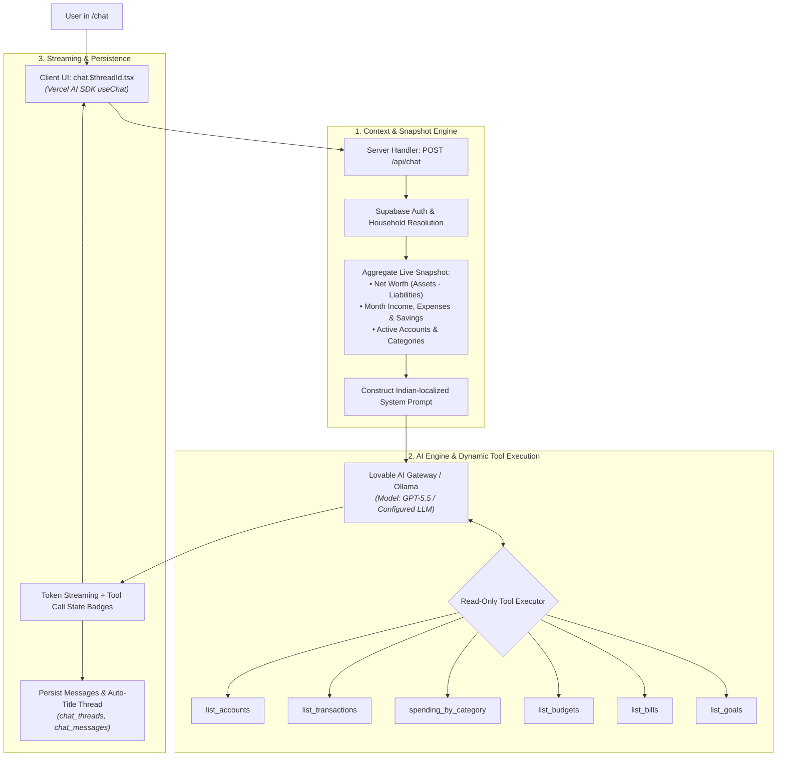

# Ask Paisa — Conversational Financial Assistant Architecture

**Ask Paisa** (`/chat`) is the integrated AI-powered personal financial assistant designed specifically for Indian personal finance contexts. It allows users to query, analyze, and understand their live financial data (balances, cash flow, transactions, categories, budgets, bills, and goals) through a natural, streaming chat interface.

---

## 1. High-Level Architecture



---

## 2. Core Modules & Directory Map

| Layer | File Path | Responsibility |
| :--- | :--- | :--- |
| **API Endpoint** | [`src/routes/api/chat.ts`](src/routes/api/chat.ts) | Server handler, dynamic snapshot generation, tool calling definitions, and response streaming. |
| **Chat Page Layout** | [`src/routes/_authenticated/chat.tsx`](src/routes/_authenticated/chat.tsx) | Sidebar with thread history, create/rename/delete threads. |
| **Thread View** | [`src/routes/_authenticated/chat.$threadId.tsx`](src/routes/_authenticated/chat.$threadId.tsx) | Active conversation view, message history, live tool call badges, and auto-scrolling. |
| **Index / Landing** | [`src/routes/_authenticated/chat.index.tsx`](src/routes/_authenticated/chat.index.tsx) | Empty-state landing screen with suggested prompt pills. |
| **Server Functions** | [`src/lib/chat.functions.ts`](src/lib/chat.functions.ts) | Thread and message CRUD server functions. |
| **AI Gateway** | [`src/lib/ai-gateway.server.ts`](src/lib/ai-gateway.server.ts) | Custom OpenAI-compatible provider wrapper for Lovable AI Gateway / Ollama. |

---

## 3. Detailed Logic Flow

### A. Context Injection & System Prompt
Every chat request is scoped to the authenticated user's `household_id`. Before passing messages to the LLM, the backend calculates an instant household snapshot:
- **Net Worth**: Computes active INR asset balances minus liabilities.
- **Current Month Cash Flow**: Computes total income, total expenses, and net savings from the 1st of the current month.
- **Account & Category Roster**: Injects active account count and top expense category names.
- **Indian Locale Formatting**: Instructs the model to output amounts in Indian Rupees (`₹`), format numbers with Lakh/Crore notation (`en-IN`), and structure multi-row comparisons in Markdown tables.

```typescript
// Snapshot generation in src/routes/api/chat.ts
const systemPrompt = `You are Paisa, a helpful personal finance assistant for an Indian user. Answer in a friendly, concise tone. Format numbers in Indian rupees with Indian lakh/crore notation when large. Use markdown for lists and small tables when useful.

Current snapshot for ${profile?.display_name ?? "the user"} (household ${householdId}):
- Net worth: ${fmt(nw)} (assets ${fmt(assets)}, liabilities ${fmt(liab)})
- This month income: ${fmt(income)}, expense: ${fmt(expense)}, savings: ${fmt(income - expense)}
- Accounts: ${(accounts ?? []).length} total
- Available expense categories include: ${categories.join(", ")}
...`;
```

---

### B. Dynamic Tool Calling (Function Calling)

The model is provided with 6 deterministic, read-only tools that execute securely against the database:

1. **`list_accounts`**
   - **Purpose**: Lists all bank, credit card, loan, and investment accounts with institutions, account categories, and live balances.
2. **`list_transactions`**
   - **Purpose**: Queries recent transaction rows.
   - **Parameters**: `limit` (1–100), `since_date` (`YYYY-MM-DD`), and `type` (`income` | `expense` | `transfer`).
3. **`spending_by_category`**
   - **Purpose**: Aggregates expense transactions grouped by category for any timeframe, sorted in descending order of total spend.
   - **Parameters**: `since_date` (`YYYY-MM-DD`, defaults to start of current month).
4. **`list_budgets`**
   - **Purpose**: Retrieves active monthly and custom budgets along with their linked category IDs and threshold limits.
5. **`list_bills`**
   - **Purpose**: Fetches upcoming recurring bills, subscription reminders, and payment statuses.
6. **`list_goals`**
   - **Purpose**: Fetches user-defined savings goals, target deadlines, target amounts, and current allocated savings.

---

### C. Safety Guardrails & Principles

1. **Strict Read-Only Constraint**: The AI assistant has no mutation tools. It cannot insert, edit, or delete transactions, accounts, or budgets. If a user asks to modify data, it directs them to the respective screen in the UI.
2. **Household RLS Enforcement**: Every Supabase query inside tool executors enforces `eq("household_id", householdId)`.
3. **No Data Fabrication**: System instructions explicitly enforce that if a query returns empty results, the model must declare that no records were found rather than hallucinating plausible figures.

---

### D. Streaming & Thread Lifecycle

1. **Live Token & Tool Streaming**:
   - Uses `@ai-sdk/react`'s `useChat` hook with `DefaultChatTransport`.
   - Tool execution status is displayed inline to the user (e.g. `Fetching: spending_by_category…` $\to$ `Looked up: spending_by_category`).
2. **Auto-Titling**:
   - New threads initialize with the title `"New chat"`.
   - On the completion of the first prompt turn, the thread title is automatically summarized and updated to the first 60 characters of the user's initial inquiry.
3. **Message Persistence**:
   - Completed turns are stored in `chat_messages` (persisting role, message parts, and tool results) and indexed by `thread_id` and `household_id`.
